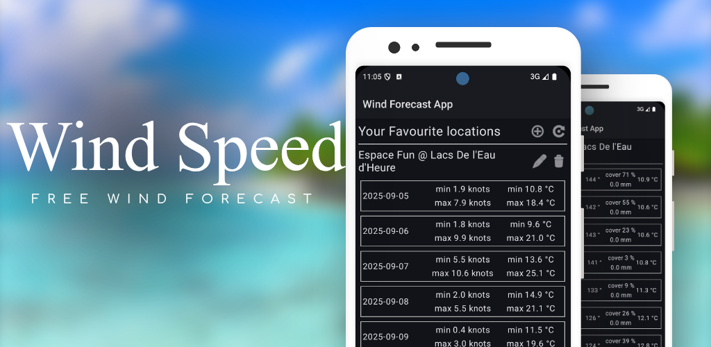

# Wind Forecast App

An overview of wind speed forecasts for given (favorites) locations 
for the coming 10 days (configurable). Plus a detail view of the hourly 
forecast for each given location.



Available from Google Play: https://play.google.com/store/apps/details?id=be.hcpl.android.speedrecords 

 

## How to Use

### Adding locations

You can add locations by sharing text in format: `lat, lng, locationName` 
with locationName being optional. The separator is important: `, ` For example: 

```
50.85045, 4.34878, Brussels BE
```

If you use Google Maps for example to pick a location you can drop a pin
anywhere and it should give you a share option to share these coordinates. 

Note that if the pin resolves as a known location it tries to share as a 
Google maps link instead which won't work. Alternative option is to share
from any text based app where you enter in the above format. 

Video showing this procedure:


### Exploring Forecast

For each added location the daily forecast for the coming 10 days is shown 
on the first screen. I will make the number of days a configurable option.
Showing values are:

```
day & date | min & max wind speed | min & max temp 
```

When picking a day it will navigate to a detail screen. Format used there is:

```
hour in day | wind speed & gusts | wind direction | cloud cover & precipitation | air temperature 
```

From this screen you can always narrow down the number of hours that should show.
If you later want to bring back some hours you can use the refresh icon on top screen. 

# Version History

## 0.5.0

- layout improvements
- render current settings on overview screen
- allow for changing data source

## 0.4.0

- show error when parsing location failed
- added support for fahrenheit
- also show name of day in detail view

## 0.3.0

- icons for weather indication
- show wind direction with icon
- added pull to refresh
- show error on problems

## 0.2.0

- improved app icon
- layout improvements
- bugfix dropping hours from detail
- bugfix navigation on rotation
- fix system bar colors

## 0.1.1

- fixed back handling
- add selected date on top for detail view
- fix adding locations in other formats
- added confirmation before restoring all hours

## 0.1.0

Initial app release

# TODO

## Features & TODO 

- allow for easy location input from in app map
- improve UI (more graphics and colours)
  - allow for custom colours, hours, warnings, thresholds, ...
  - optimize use of screen width 
- add about information to app
  - api info and libs
  - explain how to add locations, also in app
- Custom Config Options
  - set number of days to fetch in the future
  - (opt) how many days in the past
  - threshold for marking values in colours
  - selectable weather source (currently only open-meteo)
- long press to mark a moment

## Bugs

- fix missing translations

# Resources

For release sign with v1 key
And bundle as APK for now

## Dependencies

retrofit for network calls: https://square.github.io/retrofit/

see also: https://medium.com/@pritam.karmahapatra/retrofit-in-android-with-kotlin-9af9f66a54a8

weather forecast api: https://open-meteo.com/en/docs/ecmwf-api

weather icons from https://openweathermap.org

google play store art created with: https://hotpot.ai/design/google-play-feature-graphic?id=34

logo with: https://hotpot.ai/logo-generator/create and https://romannurik.github.io/AndroidAssetStudio/

pull to refresh implementation: https://developer.android.com/develop/ui/compose/components/pull-to-refresh

## General Info

wind speed at 10 vs 100m; altitude that is, see more info at https://www.nature.com/articles/s41598-025-88295-8

info on using dialogs in compose https://stackoverflow.com/questions/68852110/show-custom-alert-dialog-in-jetpack-compose

Some Data sources
- "ecmwf" European Centre for Medium-Range Weather Forecasts, global
- "noaa" The National Oceanic and Atmospheric Administration, global except some smaller places

## WMO Weather Code

General information on these codes: 
https://www.nodc.noaa.gov/archive/arc0021/0002199/1.1/data/0-data/HTML/WMO-CODE/WMO4677.HTM

Example of mapping these codes to descriptions and images:
https://gist.github.com/stellasphere/9490c195ed2b53c707087c8c2db4ec0c

## Available "free" wind API

An overview of the weather API that I checked. 

### open-meteo.com

https://open-meteo.com/en/docs/ecmwf-api

Similar providers listed as stormglass.io api but opensource and free.

example request:

https://api.open-meteo.com/v1/forecast?latitude=50.85045&longitude=4.34878&hourly=temperature_2m,apparent_temperature,precipitation,rain,weather_code,cloud_cover,wind_speed_10m,wind_direction_10m,wind_gusts_10m,wind_speed_100m,wind_direction_100m,surface_temperature&models=ecmwf_ifs025&wind_speed_unit=kn&start_date=2025-08-27&end_date=2025-09-10

simplified:

https://api.open-meteo.com/v1/forecast?latitude=50.85045&longitude=4.34878&hourly=temperature_2m,precipitation,weather_code,cloud_cover,wind_speed_10m,wind_direction_10m,wind_gusts_10m&models=ecmwf_ifs025&wind_speed_unit=kn&start_date=2025-08-27&end_date=2025-09-10

execute for example response or see [example json](attachment:release/example-response.json)

### openweathermap.org

https://openweathermap.org/api

Also free, but subscription based, first 1k calls per day for free + 0.0014 EUR per next call.

### weatherapi.com

https://www.weatherapi.com/pricing.aspx

See link for pricing info.

### meteoblue.com

https://content.meteoblue.com/en/business-solutions/weather-apis/forecast-api

### stormglass.io

https://docs.stormglass.io/#/authentication

10 requests per day are free (too limited for actual use, even personal only). 
Pricing plans are per month and quite expensive, starting at 19 EUR/m for 500 requests.
